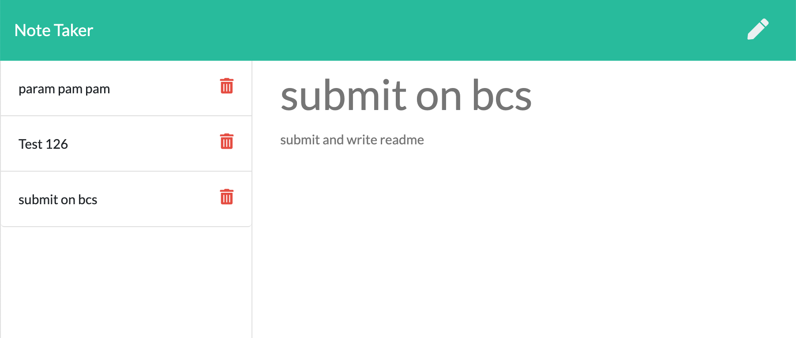

# Note Taker 
  Allows to save and to delete notes.
  # Table of Contents
  1. [Installation](#installation)
  2. [Usage](#usage)
  3. [License](#license)
  4. [Detailed description](#detailed-description)
  5. [Files](#files)
  6. [Contribution Guidelines](#contribution-guidelines)
  7. [Questions](#questions)
## Installation
To install please use: 
`npm install`
## Usage
To use do next: 
`npm start` or go to [deployed](https://shrouded-stream-05696.herokuapp.com/)
## License
[License: MIT](https://opensource.org/licenses/MIT)
## Deatiled description
App deployed at [heroku](https://shrouded-stream-05696.herokuapp.com/).

Note taking page looks like

App allows to create new notes, to look at content of old notes and to delete notes.

When a note is created app gives it unique ID (next after last note has). This ID used when I delete nodes.
## Files
- `public` - static files for site and frontend script
- `routes/htmlRoutes.js` - routes to main and notes pages
- `routes/apiRoutes.js` - api routes that allows to create, show and delete notes
- `db\db.json` - contains all notes in json format
- `server.js` - initialize server 
## Contribution Guidelines 
Ask me
## Test
To test use:
` no test yet`
## Questions
For questionts please contact [me](https://github.com/Myau5x) at ola.illari@gmail.com
 

